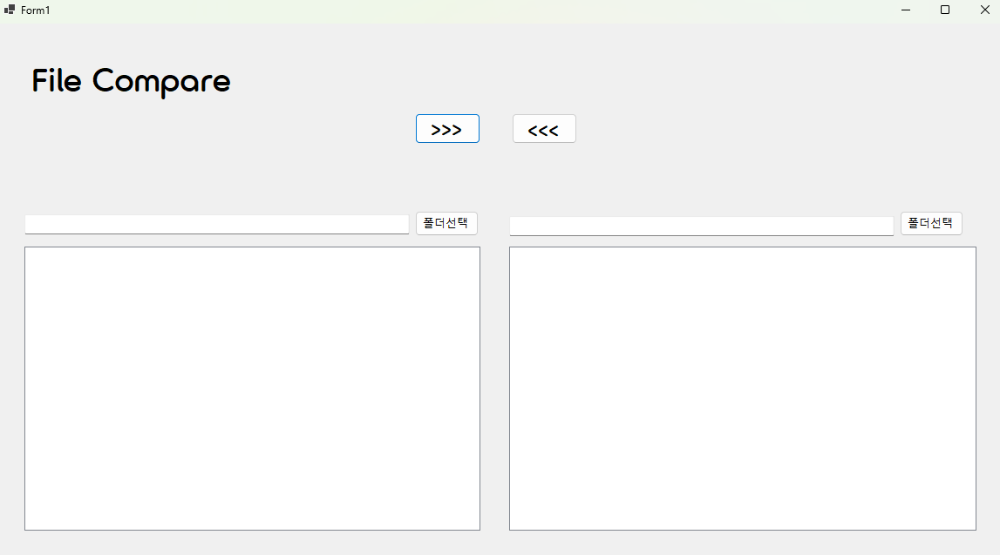

# (C# 코딩) <프로젝트 이름>

## 개요
- C# 프로그래밍학습
- 1줄소개: 두 폴더에 담긴 파일을 비교하고, 최신 버전으로 파일을 관리하는 프로그램입니다.
- 사용한플랫폼: 
  - C#, .NET Windows Forms, Visual Studio, GitHub
- 사용한컨트롤:
  - Label, Button, TextBox, ListView, Panel, SplitContainer
- 사용한기술과구현한기능:
 - 파일 비교 및 상태 표시
 - 선택 파일 복사
 - 파일 비교 결과를 색상으로 표시
 - 선택 강조

## 실행화면(과제1)
- 과제1코드의실행스크린샷

- 과제내용
 - UI 구성
 - 컨트롤의 기본 기능 확인과 구현
   
- 구현내용과기능설명
 - GUI 설계
 - 컨트롤 배치
 - 컨트롤에서 기본적으로 제공하는 기능 구동 확인합니다
 - 다시 주문할 수 있도록 초기화합니다

## 실행화면(과제2)
- 과제2코드의실행스크린샷

- 과제내용
 - 폴더 선택 기능과 색상을 구분하고 표시하며 파일 리스트 기능을 구현합니다

- 구현내용과기능설명
 - 양쪽 폴더의 파일 표시합니다.

## 실행화면(과제3)
- 과제3코드의실행스크린샷

- 과제내용
 - 양쪽 폴더 사이에서 파일의 복사 기능 구현

- 구현내용과기능설명
 - 선택한 파일을 반대쪽 폴더로 복사하기
 - 수정된 날짜 정보를 확인해서 “확인” 받아 진행여부 결정하기

구현하는 데에 있어 어려웠던 점
 - 기본 UI를 구성하는데에 필요한 앵커 기능에서 오히려 어려움을 느꼈습니다. 무엇이 되었든 기본이 제일 중요하다는 것을 다시금 깨닫게 되었습니다.
